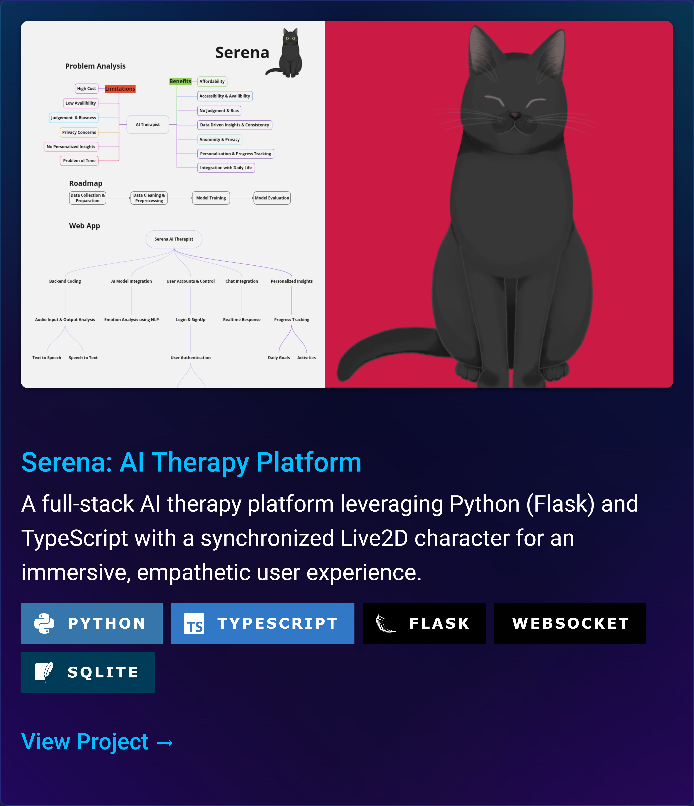
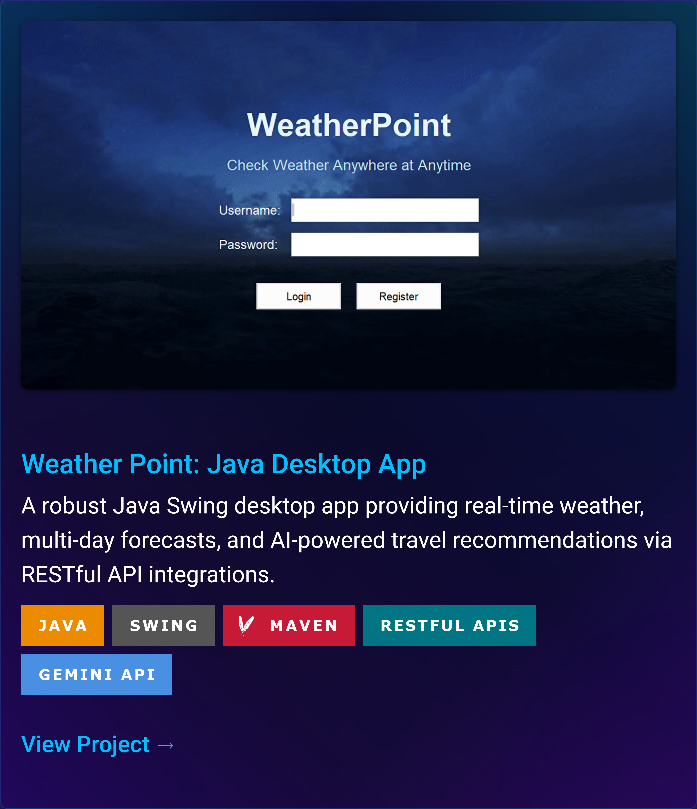
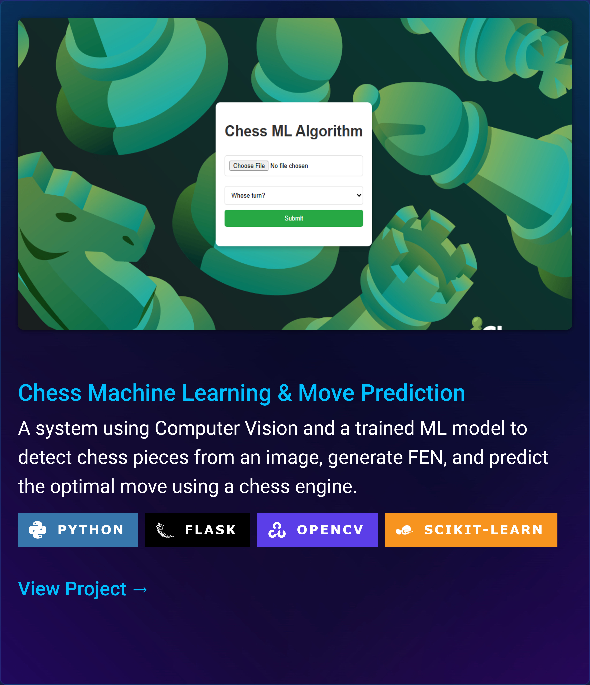
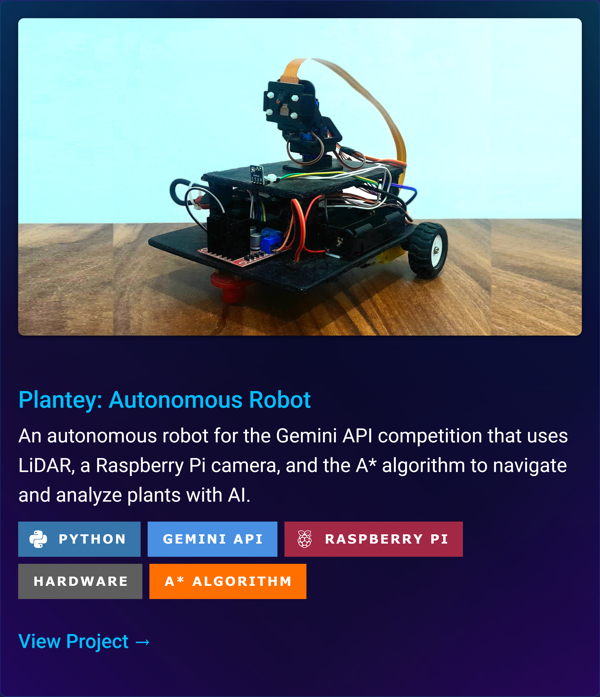
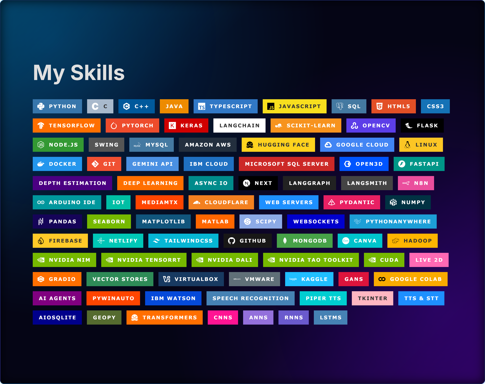

<table align="center" border="0" cellpadding="0" cellspacing="0" style="width:100%; border-collapse: collapse; border-spacing: 0;">
<tbody>
 
  <tr>
    <td colspan="2" style="padding: 0 0 15px 0; line-height: 0;">
      
    </td>
  </tr>
  

  <tr>
    <td colspan="2" style="padding: 0 0 15px 0; line-height: 0;">
      
    </td>
  </tr>

  <tr>
    <td width="50%" style="padding: 0; line-height: 0;">
      
    </td>
    <td width="50%" style="padding: 0; line-height: 0;">
      
    </td>
  </tr>
  

  <tr>
    <td width="50%" style="padding: 0; line-height: 0;">
      
    </td>
    <td width="50%" style="padding: 0; line-height: 0;">
      
    </td>
  </tr>

  <tr>
    <td colspan="2" style="padding: 15 0 0 0; line-height: 0;">
    
    </td>
  </tr>
</tbody>
</table>