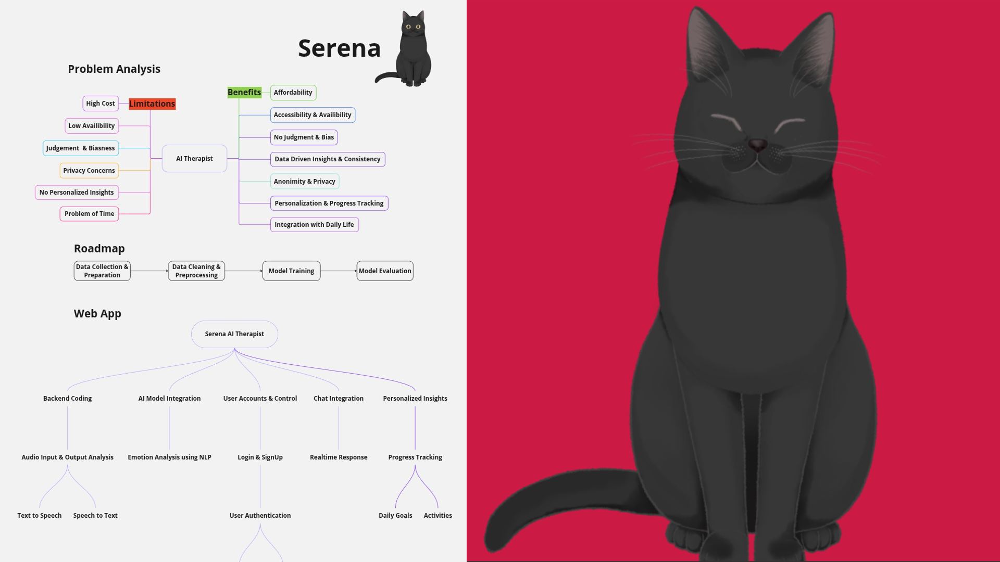
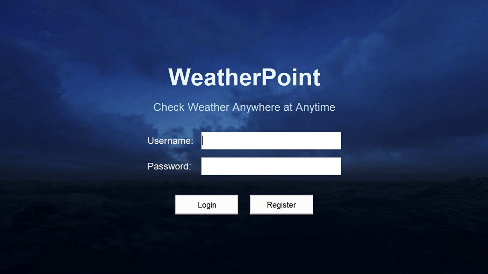
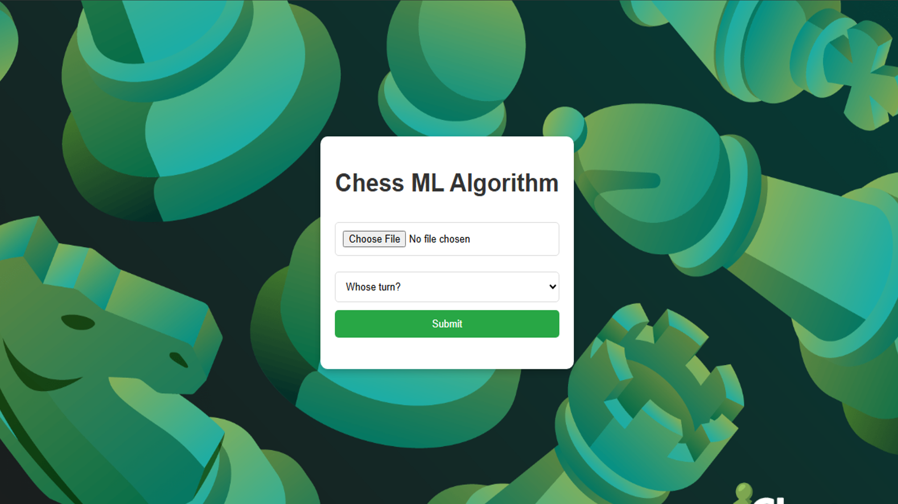
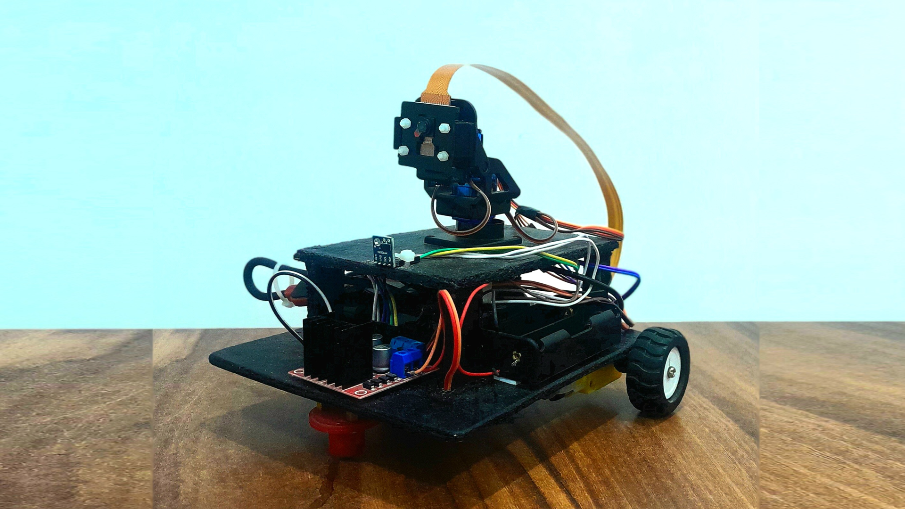

  <h1>
    Hey there, I'm Lovejeet Matharu! 
    
  </h1>
  

    <strong>AI & Machine Learning Engineer</strong>
  

  

    I'm a Master's candidate specializing in AI, driven by a deep passion for robotics, autonomous systems, and continuous learning.
     
    My focus is on applying state-of-the-art AI to build tangible innovations—from intelligent user-assistance platforms to complex autonomous robots that perceive and interact with the world.
  

  

---

## My Featured Projects

<table style="margin-bottom: 50px;">
  <tr>
    <td width="50%" style="vertical-align: top; padding: 10px;">
      <h5>            </h5>
      
      <h3>Serena: AI Therapy Platform</h3>
      
A full-stack AI therapy platform leveraging Python (Flask) and TypeScript with a synchronized Live2D character for an immersive, empathetic user experience.

      

        
        
        
        
        
      

      <a href="https://github.com/LovejeetM/Serena" target="_blank">View Project →</a>
      <h5>            </h5>
    </td>
    <td width="50%" style="vertical-align: top; padding: 10px;">
      <h5>            </h5>
      
      <h3>Weather Point: Java Desktop App</h3>
      
A robust Java Swing desktop app providing real-time weather, multi-day forecasts, and AI-powered travel recommendations via RESTful API integrations.

      

        
        
        
        
        
      

      <a href="https://github.com/LovejeetM/Weather-Point" target="_blank">View Project →</a>
      <h5>            </h5>
    </td>
  </tr>
  <tr>
    <td width="50%" style="vertical-align: top; padding: 10px;">
      <h5>            </h5>
      
      <h3>Chess ML & Move Prediction</h3>
      
A system using Computer Vision and a trained ML model to detect chess pieces from an image, generate FEN, and predict the optimal move using a chess engine.

      

        
        
        
        
      

      <a href="https://github.com/LovejeetM/Chess_ML_Algorithm" target="_blank">View Project →</a>
      <h5>            </h5>
    </td>
    <td width="50%" style="vertical-align: top; padding: 10px;">
      <h5>            </h5>
      
      <h3>Plantey: Autonomous Robot</h3>
      
An autonomous robot for the Gemini API competition that uses LiDAR, a Raspberry Pi camera, and the A* algorithm to navigate and analyze plants with AI.

      

        
        
        
        
        
      

      <a href="https://github.com/LovejeetM/autonomous_robot" target="_blank">View Project →</a>
      <h5>            </h5>
    </td>
  </tr>
</table>

---

## My Tech Stack

  <strong>Languages:</strong> 
  
  
  
  
  
  
  
  

  <strong>AI / ML Frameworks:</strong> 
  
  
  
  
  

  <strong>Backend, Frontend & Databases:</strong> 
  
  
  
  
  

  <strong>Tools, Platforms & Cloud:</strong> 
  
  
  
  
  
  

---