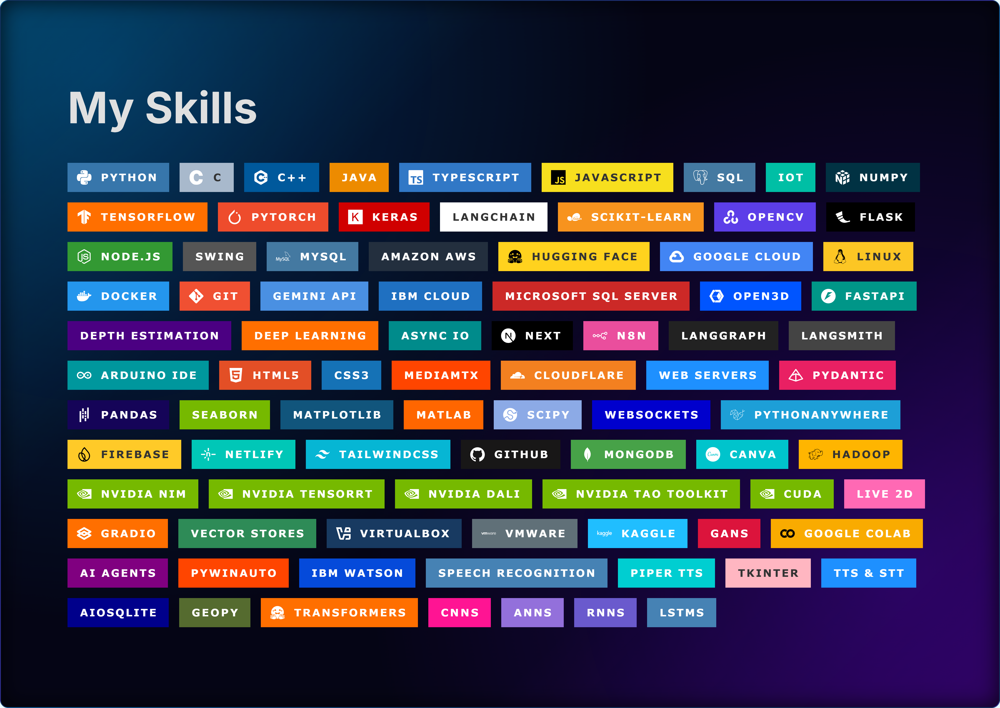

  

  

<table align="center" border="0" cellpadding="0" cellspacing="0" style="width:100%; border: none; margin-bottom: 0;">
  <tr>
    <td width="50%" style="padding: 0;">
      
    </td>
    <td width="50%" style="padding: 0;">
      
    </td>
  </tr>
  <tr>
    <td width="50%" style="padding: 0;">
      
    </td>
    <td width="50%" style="padding: 0;">
      
    </td>
  </tr>
</table>

  

